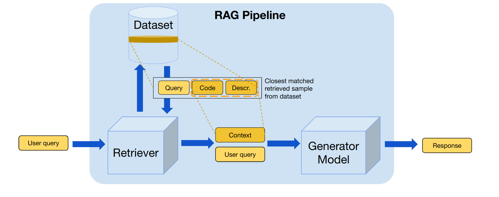

## Key Methodology Components

### The Base RAG Pipeline for Main Use Case Scenario

This project implements a Retrieval-Augmented Generation (RAG) pipeline for answering domain-specific questions using a large language model (LLM). It combines a precomputed FAISS vectorstore of embeddings with the Mistral-7B-Instruct model to provide accurate and context-aware responses. When a user submits a query, the pipeline first retrieves the most relevant context from the vectorstore using semantic similarity. This context is then inserted into a structured instruction-style prompt, which is fed to the LLM to generate an answer. The system parses the output into context, question, and answer components and logs each interaction in a JSON dataset for future reference. This approach allows efficient querying over large datasets.

